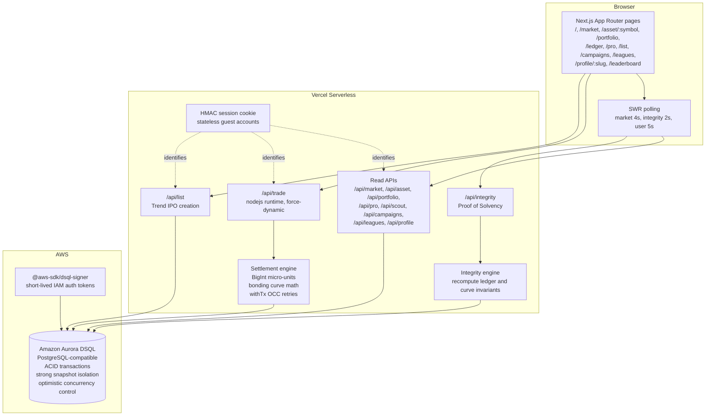
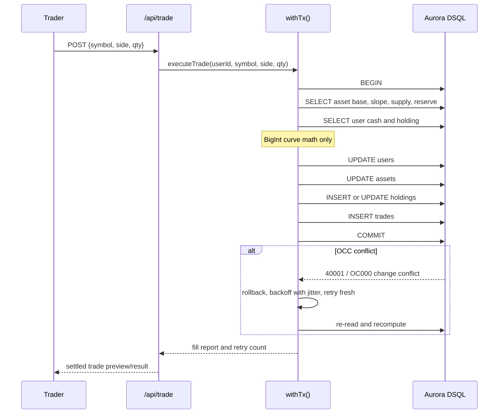
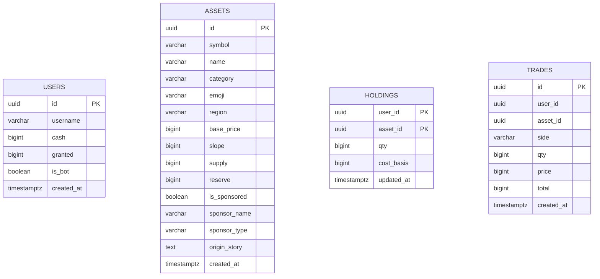

# HYPE Architecture

HYPE is a culture exchange built on Next.js, Vercel, and Amazon Aurora DSQL. The
application is designed around one principle: the database is the trust boundary.
The UI can be playful, but settlement and solvency are verified from durable state.

## System Overview



SVG version: [architecture.svg](architecture.svg)

## Request Flow

### Read paths

Most pages are read-heavy:

- `/market` reads asset stats, 24h volume, change, sponsored/new/hot signals, and sparkline points.
- `/asset/[symbol]` reads a single asset terminal, chart series, recent tape, and current user position.
- `/pro` derives B2B analytics from existing assets and trades.
- `/portfolio` reads holdings plus `/api/scout` for the Trend Scout Score.
- `/campaigns`, `/leagues`, and `/profile/[slug]` are product surfaces derived from current market data.
- `/ledger` polls `/api/integrity` every two seconds.

These routes do not move money.

### Write paths

There are two important write paths:

- `/api/trade` calls `executeTrade()` and moves cash, reserves, holdings, and trade tape entries.
- `/api/list` creates a new cultural asset with initial `supply = 0` and `reserve = 0`, which preserves
  `reserveAt(base, slope, 0) === 0`.

The trading engine is the critical path. Listing creates metadata and a clean curve; it does not alter
existing balances, reserves, or treasury funds.

## Settlement Transaction

Every trade is one ACID transaction:



The cost is recomputed after every retry. A stale quote is never committed after a
concurrent trade changes supply.

## Transaction Modes

HYPE supports local Postgres and Aurora DSQL through the same code path.

```ts
await client.query(isDsql() ? "BEGIN" : "BEGIN ISOLATION LEVEL REPEATABLE READ");
```

- Aurora DSQL uses `BEGIN` because DSQL already provides strong snapshot isolation.
- Local Postgres uses `REPEATABLE READ` so hot-row conflicts surface as retryable errors instead of
  silently allowing lost updates.

Retryable transaction errors include:

- SQLSTATE `40001`
- SQLSTATE `40P01`
- messages containing `OC000`
- messages containing `change conflicts with another transaction`

Backoff uses a 25ms base, jitter, and a 1000ms cap. The current engine allows up to 64 attempts
for high-contention demo bursts.

## Data Model



Design choices for DSQL:

| Choice | Reason |
|---|---|
| App-minted UUIDs | Avoids sequences and removes a global coordination point. |
| No foreign keys | DSQL does not enforce them; the settlement transaction is the integrity boundary. |
| Composite `holdings(user_id, asset_id)` key | First-buy races become deterministic OCC conflicts. |
| `users.granted` | Makes total minted money a direct aggregate. |
| `CREATE INDEX ASYNC` | Required for Aurora DSQL secondary index creation. |

## Invariants

HYPE verifies two exact invariants:

```txt
sum(user.cash) + sum(asset.reserve) === sum(user.granted)
asset.reserve === reserveAt(base, slope, supply)
```

Because money is stored as integer micro-units, the check is exact. There is no floating
point tolerance and no reconciliation process.

## Product Layers On Top Of The Ledger

The current app builds several read-only or analytics surfaces on top of the exchange:

- Market board filters and badges.
- Market depth / slippage simulator.
- HYPE Pro analytics.
- Trend Scout Score.
- Sponsored IPOs.
- Creator Revenue Engine / royalty simulation.
- Brand Campaign Missions.
- Culture Leagues.
- Creator and brand profiles.

These layers are intentionally separated from settlement. They make the product feel
venture-scale without changing the ledger math.
